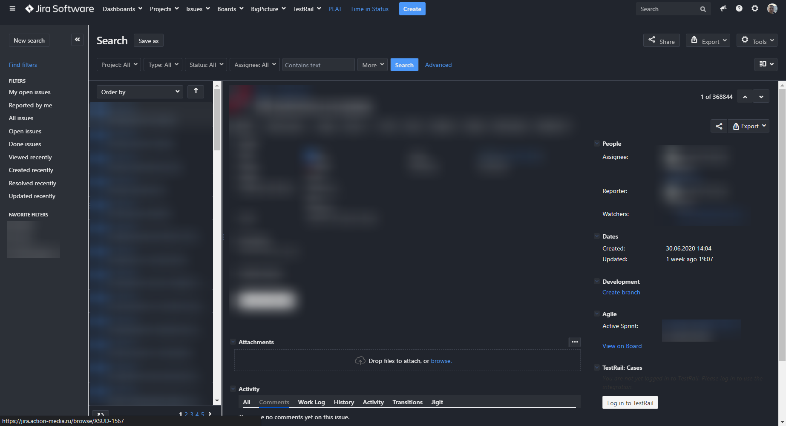

# jira-dark-theme
A dark theme for jira based off of [Jira Carbon 2](https://userstyles.org/styles/164736/jira-carbon-2) for use in stylus

## Installation

- Install a Userstyle-Addon like Stylus ([Firefox](https://addons.mozilla.org/de/firefox/addon/styl-us/), [Chrome](https://chrome.google.com/webstore/detail/stylus/clngdbkpkpeebahjckkjfobafhncgmne))
- Create a new style and copy the content of [`style.css`](style.css) into it

Make sure to restrict the scope of the style to the  Jira domain
